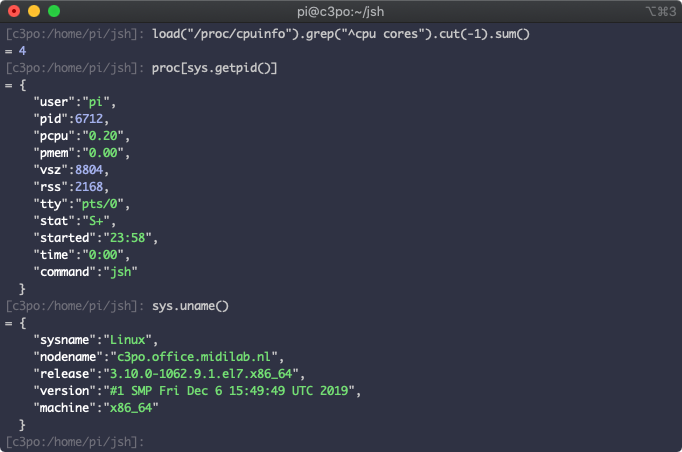
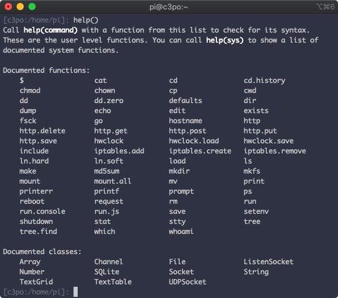

# JSH - A cleaner environment for your dirty low-end jobs

A lot of work on a typical Unix system still gets performed by the system
shell interpreter. Look under the hood of your average system, and you will
find tons of bash-based glue that manages to hold a system together, but
generally while relying on a metric ton of dirty hacks.

The problem here is that sh/bash is a pretty dirty language, with no typing,
and a heavy emphasis on processing a bunch of strings. A proper language
being thrown at this problem is never going to fare well, since there's
usually a heavy disconnect between how those languages interact internally
versus dealing with the Unix environment.

## Javascript to the rescue

With all its warts, javascript as a base language actually matches up pretty
well with this problem domain. It, too, is a messy language when it comes
to types. But it can eat text data for lunch.

## But hold on, you want to boot into NodeJS or something?

NodeJS is a nice approach for running an asynchronous application server,
but it's actually a pretty terrible environment for exactly the problem
domain of the do-this-with-that-then-that kind of linear batch
jobs you typically want to solve in the shell environment. So the
answer to that is no.

JSH is also aimed more at embedded linux platforms, where the resource
usage of a typical NodeJS install is less than desirable.

JSH has its own runtime, built on top of Duktape, a small footprint
javacript interpreter that doesn't eat half of your system just to start
up. On top of this, a small library of functions and classes is built
that allows you to easily interact with typical unix commands, by wrapping
their command line arguments into a typically tiny javascript shell
application.

As a replacement for bash as your interactive shell, this is at best an
acquired taste. But in terms of interacting with unix commands and getting
typical shell-script work done, you end up with code that is a lot easier
to follow.

Here's how it typically looks in action:

```javascript
var installFile = function(src,dst) {
    if ((!exists(dst)) || md5sum(src) != md5sum(dst)) {
        cp (src, dst);
    }
}
```

The above script uses /usr/bin/md5sum and /usr/bin/cp on a CentOS system,
like a proper shellscript, but without all the awking, or cutting, or
regular expression voodoo you'd normally expect to get involved there. It's
also safer than most shellcode, because parameters don't end up being
suddenly ambiguous due to satanic quoting and expansion that's performed
by shells.

## Well-documented interfaces

To give you an impression of how such a wrapping looks, let's check the
source for the md5sum shell app:

```javascript
var md5cmd = "md5sum"
if (! which("md5sum")) md5cmd = "md5";

var md5sum = setapi ([
    {name:"md5sum"},
    {setarg:"path"},
    {literal:md5cmd},
    {arg:"path",helptext:"File to checksum"},
    {process:function(dat) {
        dat = dat.replace('\n','');
        if (md5cmd == "md5sum") return dat.split(' ')[0];
        return dat.replace (/^.* /,"");
    }},
    {helptext:"Get md5 checksum for a file. Returns a hexadecimal string "+
              "representing the checksum."}
]);

module.version = "1.0.0";
module.exports = md5sum;
```

The wrapping leaves an md5sum() function on the global namespace, as well
as documentation for its arguments, which is available from the jsh
interactive console by typing help(md5sum). It's very easy to keep every
aspect of the environment documented, and explorable.



## Some extra sugar

A lot of jobs in the shell-script domain end up needing to rewrite
configuration files, and there's no way in any current language to not
make code for that look awkward. The JSH parser adds an extra style
of text quotes to javascript, specifically to solve this problem. It
allows for inlining variable templates, but, most importantly, it deals
with the text being indented, by looking at the first line of text, and
cutting that indentation out of each subsequent line. As long as you're
not being weirdly esoteric in mixing tabs and spaces, this works out
quite well:

```javascript
var setSystemResolverOptions = function(domain,pri,sec) {
    if (! domain) domain = "local";
    if (! pri) pri = "4.4.4.4";
    if (! sec) sec = "8.8.8.8";
    
    var rconf = <<<`
        ; System resolver configuration, do not edit manually.
        domain ${domain}
        nameserver ${pri}
        nameserver ${sec}
    `>>>;
    
    save (rconf, "/etc/resolv.conf");
}
```

Since we're incompatible now anyway, another quality of life feature added
to the parser is the '::' operator for objects, which accesses properties
within their prototype. So you can now write stuff like this:

```javascript
var Accumulator = function() {
    this._sum = 0;
}

Accumulator::add = function(i) {
    this._sum += i;
    return this;
}

Accumulator::sum = function(i) {
    return this._sum;
}

var a = new Accumulator().add("15").add("27");
echo (a.sum());
```

## And some more sugar (job control)

Sometimes asynchronous work makes sense. To help with this, JSH implements
golang-style coroutines in its runtime. They work pretty much the same way,
but under the hood they are run in a sub-process. Here's a simple example:

```javascript
var myNumberSummer = function (numbers) {
    var sum = 0;
    for (i in numbers) sum+= numbers[i];
    return sum;
}

var c = new Channel();
var numbers = [1,3,7,23,15,88,11,93,12,-4,2,15,11,25];
while (numbers.length) {
    var set = numbers.splice (0,4);
    go (c, function(){ return myNumberSummer (set); });
}

var totalsum = 0;
var m;

while (m = c.recv()) {
    echo ("Received:", m);
    totalsum += m;
}

echo ("Total sum: "+totalsum);
```

For some casual background processing, this would be enough, but sometimes
you have a job that cannot afford to have a single process running for each
part of it. So you can also spawn workers and use the channel for two-way
communication:

```javascript
var numberSumWorker = function (c) {
    var msg;
    while (msg = c.recv()) {
        var sum = 0;
        for (var i in msg) sum += msg[i];
	    c.send (sum);
    }
}

var c = new Channel();
var numbers = [441,755,387,504,154,244,732,245,620,451,58,811,170,878,71,975,
               589,32,86,192,288,36,974,500,878,675,881,657,893,98,472,325];

for (var i=0; i<4; ++i) {
    go (c, numberSumWorker);
}

while (numbers.length) {
    c.send (numbers.splice(0,4));
}

c.exit();

var totalsum = 0;
var m;

while (m = c.recv()) {
    echo ("Received:", m);
    totalsum += m;
}

echo ("Total sum: "+totalsum);
```

## Embedded web server

To make the inevitable confusion with Node even bigger, the jsh runtime also
ships with a separate http service that interacts with a javascript program
of your making. But instead of the asynchronous structure of Node, jshttpd
runs the script in multiple threads that don't share a common heap. This
allows the entire flow to be regular easy-to-follow synchronous code. To
accommodate shared state, a globalStorage object allows multiple threads
to store state information, with optional locked access. See the
[example code](example/example.server.js) to see how that works out.

# Getting Started

The only dependency for jsh is GNU libmicrohttpd, which is available on most
sane platforms. To get it installed on macOS using homebrew, type:

> brew install libmicrohttpd

On RedHat-derived distros, you can install through yum:

> yum install libmicrohttpd-devel

I'm not sure about the proper package-name for debian/ubuntu, so good luck
there!

After you took care of the dependency, building should be as simple as
running a 'make', possibly followed by a 'make install'. The install
defaults to /usr/local. You can also test out the jsh binary without doing
a full install by running ./jsh in the build directory, this little shell
script will set up all the proper environment variables that allow
jsh to find the necessary module files.
